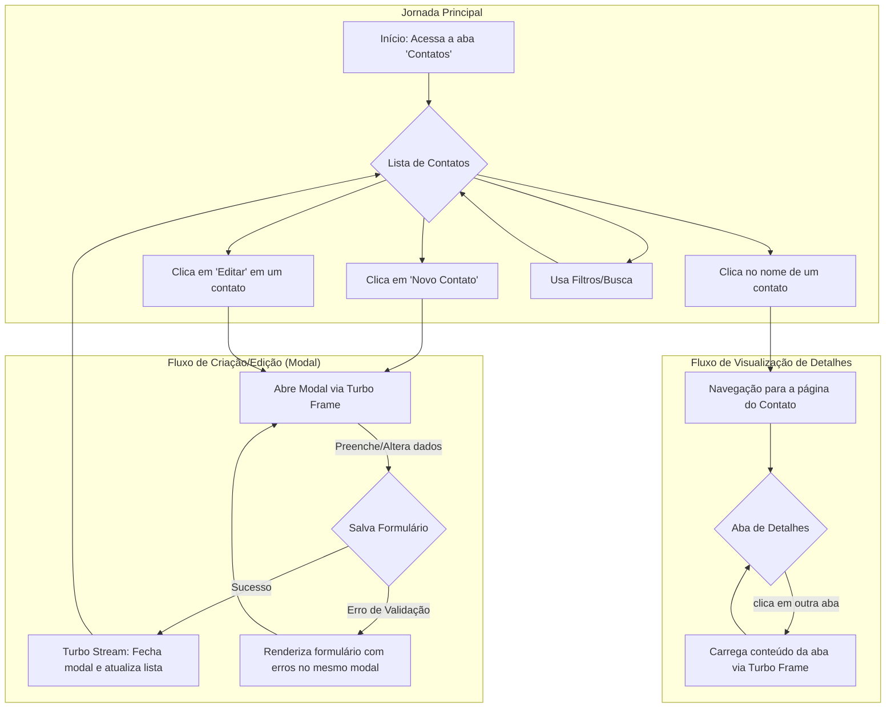

# Relatório Técnico: Arquitetura de Views do Foton Contacts

## 1. Visão Geral

Este documento é a fonte da verdade para a arquitetura, conceitos e diretrizes de frontend (UI/UX) do plugin **Foton Contacts**. Ele descreve a estrutura implementada e estabelece os princípios para a evolução da interface.

Para o plano de trabalho e tarefas pendentes, consulte o **[Workplan](workplan.md)**.
Para o manual de funcionalidades e histórico de desenvolvimento, consulte o **[Roadmap](ROADMAP.md)**.

---

## 2. Filosofia e Diretrizes de Design

O desenvolvimento do plugin é guiado por uma filosofia de design clara e consistente.

### 2.1. Princípios Fundamentais

1.  **Integração Nativa e Fluidez:** O plugin se comporta como uma extensão natural do Redmine. A experiência do usuário é fluida e sem atrito ao transitar entre as funcionalidades nativas e as do plugin.
2.  **Foco Absoluto em Usabilidade (UI/UX):** A usabilidade é a prioridade máxima. As interfaces são intuitivas, fáceis de usar, responsivas e acessíveis, fazendo uso extensivo de modais para operações rápidas.
3.  **Inteligência de Dados e Ação:** O plugin transforma dados brutos em insights acionáveis, oferecendo uma visão analítica que ajude o usuário a identificar inconsistências e mapear relacionamentos.
4.  **Desempenho:** O plugin é otimizado para um bom desempenho, mesmo com um grande número de contatos e relacionamentos, graças ao uso de carregamento sob demanda.
5.  **Segurança e Resiliência:** A arquitetura é robusta, validando todas as entradas de dados, respeitando as permissões do Redmine e tratando de forma elegante a ausência ou inconsistência de informações.
6.  **Qualidade de Código:** O projeto segue o padrão *Conventional Commits* e um fluxo de contribuição baseado no Git Flow simplificado.

---

## 3. Arquitetura e Stack Tecnológica

### 3.1. Arquitetura Histórica (Legado)

A arquitetura inicial foi baseada no padrão clássico do Rails com JavaScript Não Obstrutivo (UJS). Essa abordagem, que utilizava `remote: true` e respostas `js.erb` para manipular o DOM com jQuery, foi completamente substituída pela stack Hotwire.

### 3.2. Arquitetura Atual (The Hotwire Stack)

A arquitetura de frontend do plugin é baseada no framework **Hotwire (Turbo + Stimulus)**. Esta abordagem moderna minimiza a necessidade de JavaScript customizado e permite a criação de interfaces rápidas e reativas.

- **Turbo Drive & Frames:** A navegação é acelerada e a página é componentizada em `Turbo Frames`. Isso permite que partes da interface, como modais e abas, sejam carregadas e atualizadas de forma independente, sem a necessidade de um recarregamento completo da página. O carregamento sob demanda (`lazy-loading`) é usado extensivamente.
- **Turbo Streams:** As atualizações reativas da interface (criar, atualizar, deletar itens em uma lista) são realizadas via `Turbo Streams`. Em resposta a uma ação do usuário, o servidor envia pequenas instruções de alteração do DOM, que o Turbo executa no cliente. Este mecanismo substitui completamente a necessidade de arquivos `js.erb`.
- **Stimulus:** É utilizado para interações no lado do cliente que complementam o Hotwire. Seus principais usos no plugin são:
    - **Feedback de UI:** Desabilitar botões e exibir spinners durante o envio de formulários.
    - **Controle de Componentes:** Gerenciar a adição e remoção de campos em formulários dinâmicos.
    - **Wrappers de Bibliotecas:** Encapsular bibliotecas de terceiros, como o `Tom Select`, para uma integração limpa com o ecossistema Hotwire.

---

## 4. Guia de Componentes e Padrões de UX Implementados

Para manter a consistência e a alta qualidade da UI, os seguintes padrões foram implementados em todo o plugin:

1.  **Feedback Visual:** Toda ação assíncrona fornece feedback. Botões de submissão são desabilitados e exibem um spinner. Erros de validação são exibidos de forma clara, próximos aos campos problemáticos, sem fechar o modal.
2.  **Carregamento Sob Demanda (Lazy Loading):** O conteúdo de todas as abas nas páginas de detalhes é carregado sob demanda usando Turbo Frames com `loading="lazy"`, otimizando a performance inicial.
3.  **"Empty States" (Estados Vazios):** Nenhuma lista é exibida em branco. Um "estado vazio" informa ao usuário a ausência de dados e fornece um botão de ação claro para o próximo passo (ex: "Nenhum vínculo encontrado. [Adicionar Vínculo]").
4.  **Hierarquia Visual:** Formulários e páginas usam espaçamento, agrupamento de campos e tipografia para criar uma hierarquia clara e guiar o usuário.
5.  **Componentes Modernos:** Bibliotecas com dependência de jQuery foram removidas em favor de soluções modernas. O `Tom Select`, encapsulado em um controller Stimulus, é o padrão para campos de seleção com busca.

---

## 5. Fluxograma de Interação do Usuário

O fluxograma abaixo ilustra as principais jornadas do usuário dentro do plugin, demonstrando a arquitetura de interação implementada.

